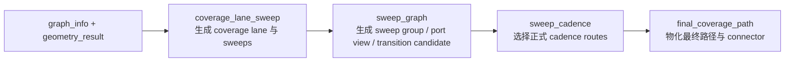
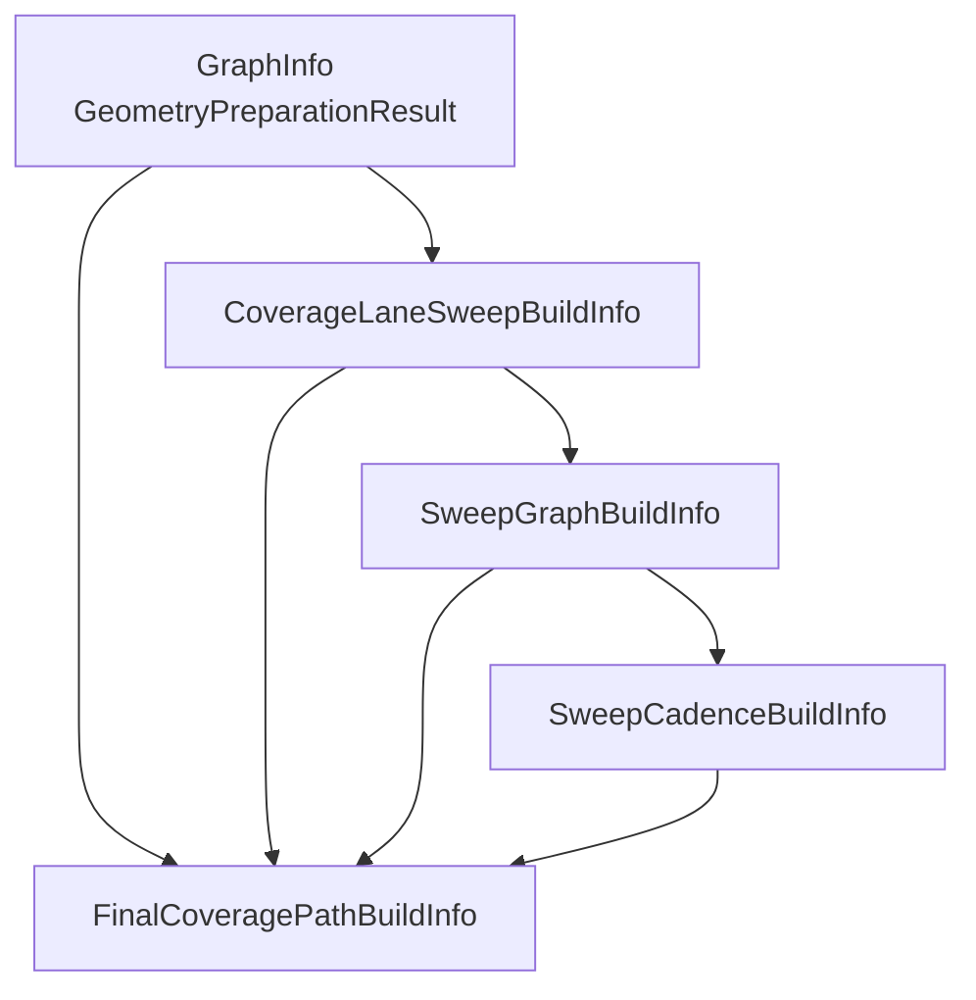
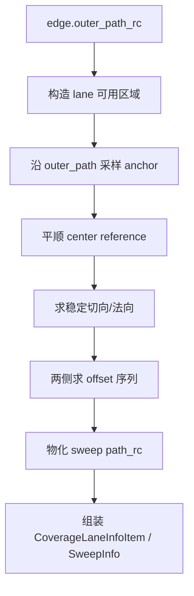
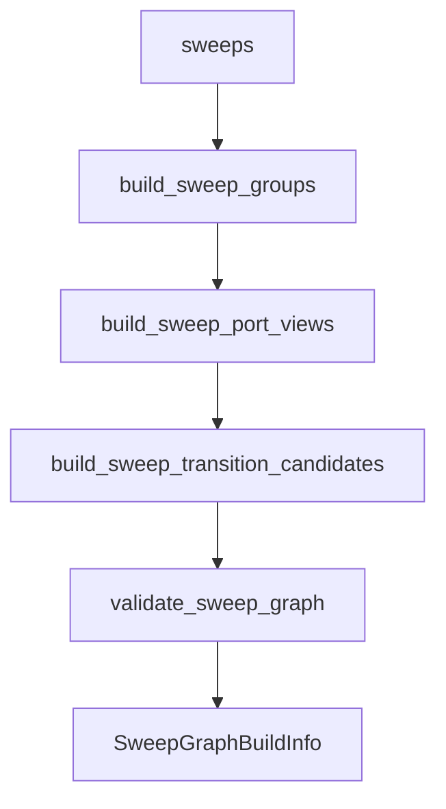
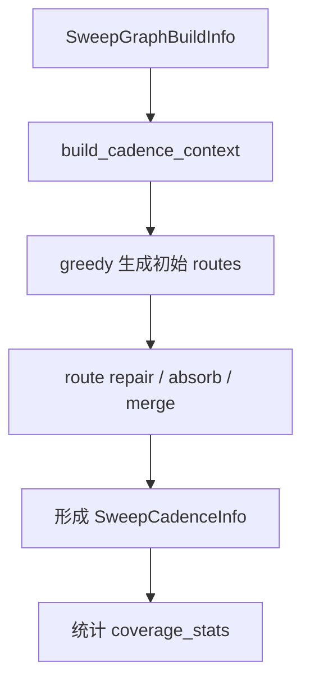
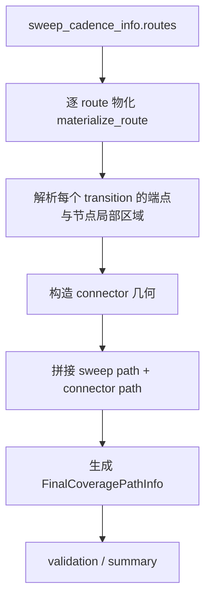
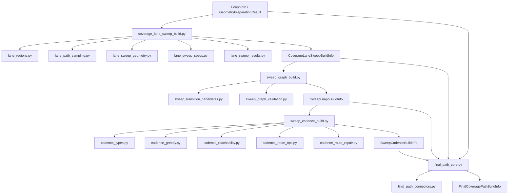

# Coverage Planning 四个主目录与文件职责说明

## 1. 文档目的

本文档只说明当前 `channel_topology_graph` 覆盖规划主链里 4 个核心目录的职责边界、文件职责和调用顺序：

- `coverage_lane_sweep`
- `sweep_graph`
- `sweep_cadence`
- `final_coverage_path`

本文档不讨论历史废弃对象，也不讨论旧版镜像链路。这里只按当前源码主线说明：

1. 先生成每条 `edge` 内部的 `sweep`
2. 再生成 sweep 之间的 transition candidate
3. 再从 candidate 中选出真正执行的 cadence
4. 最后把 cadence 物化为最终覆盖路径和节点区连接几何

---

## 2. 总体算法流程

### 2.1 主流程概览

### 2.2 输入输出关系

### 2.3 每一层解决的问题

- `coverage_lane_sweep`
  - 解决“每条 `edge` 里面有哪些 sweep，sweep 的几何路径是什么”。
- `sweep_graph`
  - 解决“这些 sweep 从哪个端出去，能合法连到哪条 sweep，上下文是什么”。
- `sweep_cadence`
  - 解决“从所有合法候选里，最终实际选择哪几条连接，把 sweeps 串成哪些 route”。
- `final_coverage_path`
  - 解决“把 cadence route 变成机器人可执行的完整路径，包括节点区连接段和最终路径点序列”。

---

## 3. `coverage_lane_sweep` 目录说明

### 3.1 目录职责

这个目录负责把 `graph_info.edges` 转换成正式的覆盖扫线结果。

它处理的问题不是 sweep 之间怎么连，而是单条 `edge` 内部怎么铺 sweep。核心工作包括：

- 读取 `edge.outer_path_rc`
- 建立该 `edge` 的有效可扫区域
- 生成 center reference 与横向分层
- 构造每一条 sweep 的 `path_rc`
- 输出 `CoverageLaneInfoItem` 和 `SweepInfo`

### 3.2 目录内部流程

### 3.3 文件职责

#### `coverage_lane_sweep_build.py`

正式入口文件，负责把单条 `edge` 的各个子步骤串起来。

核心职责：

- `build_coverage_lane_sweep_info(...)`
  - 本目录正式总入口。
  - 输出 `CoverageLaneSweepBuildInfo`。
- `build_coverage_lanes_and_sweeps(...)`
  - 遍历所有 `edge`，逐条生成 lane 与 sweeps。
- `build_single_coverage_lane(...)`
  - 对单条 `edge` 执行完整 sweep 构造流程。
  - 会调用区域构造、spec 构造、结果物化等辅助模块。

#### `lane_regions.py`

负责“这条 `edge` 内哪些自由区域允许参与 sweep 生成”。

核心职责：

- 构造节点 polygon 遮挡
- 构造端点 polygon block mask
- 从 `outer_path` 派生本 edge 的有效区域
- 构造 `allowed_domain_mask`
- 为单条 lane 提供稳定的区域边界

这部分决定 sweep 的可用空间，不负责具体 sweep 轨迹怎么排。

#### `lane_path_sampling.py`

负责对路径按固定距离做采样。

核心职责：

- 沿 `outer_path` 或 reference path 均匀采样
- 为后续 anchor 布局提供稳定点列

它是一个纯几何采样工具层，不承载 sweep 语义。

#### `lane_sweep_geometry.py`

负责 sweep 横向展开时的局部几何计算。

核心职责：

- 估计局部切向 `tangent`
- 从切向求法向 `normal`
- 搜索法向上的合法点
- 统计局部可容纳的 sweep 数量
- 构造给定区间内的均匀 offset

这部分回答的是“某个 anchor 在横向上最多能铺几层、每层落在哪”。

#### `lane_sweep_specs.py`

负责把离散 anchor 上的局部几何信息，整理成整条 lane 的正式 sweep 规格。

核心职责：

- 收集所有 anchor 的局部布局
- 平顺 center reference path
- 两侧分别求解 offset 序列
- 处理首尾相交时的收尾裁剪
- 输出 `build_lane_sweep_specs(...)` 的正式规格结果

这是 `coverage_lane_sweep` 里最接近“算法核心”的文件，因为它真正决定 sweep 的布局形态。

#### `lane_sweep_results.py`

负责把已经求出的 layout/spec 物化为正式结果对象。

核心职责：

- 初始化 `CoverageLaneInfoItem`
- 按 layout 构造正式 `SweepInfo`
- 构造失败调试信息
- 构造 summary / validation
- 给 edge 附加 coverage 投影信息

这部分不再决定 sweep 怎么求，而是负责“求出来以后怎么落成正式对象”。

#### `lane_common.py`

提供通用几何小工具。

核心职责：

- 路径长度计算
- 向量归一化
- mask 点集转换
- path 统一格式化

这个文件只做基础工具，不承载业务决策。

---

## 4. `sweep_graph` 目录说明

### 4.1 目录职责

这个目录负责从已经生成好的 `sweeps` 出发，建立 sweep 层的静态图和连接候选。

它处理的问题是：

- 哪些 sweep 属于同一个 group
- 每个 group 在 `src/dst` 端口处的 sweep 排序是什么
- 哪些 sweep 之间可以形成 transition candidate
- 每个 candidate 的来源、连接语义、得分和风险是什么

这一步仍然不是“最终选择”，而是“正式候选生成”。

### 4.2 目录内部流程

### 4.3 文件职责

#### `sweep_graph_build.py`

本目录正式入口文件，负责组装 sweep graph 主对象。

核心职责：

- `build_sweep_graph_info(...)`
  - 本目录总入口。
  - 组织 group、port view、candidate、graph summary。
- `build_sweep_groups(...)`
  - 以 `coverage_lane` 为单位聚合 sweeps。
  - 形成 `group_id`、`ordered_sweep_ids`、`center_sweep_id` 等组真值。
- `build_sweep_port_views(...)`
  - 为每个 group 的 `src/dst` 两端建立 port 视图。
  - 给出节点端口上的 sweep 排序。
- `build_sweep_graph(...)`
  - 构造最小 sweep 静态骨架。
- `resolve_sweep_transition_candidates(...)`
  - 统一解析正式 transition candidate 输出面。

可以把这个文件理解为 stage B 的主装配器。

#### `sweep_transition_candidates.py`

本目录真正的候选生成核心文件。

核心职责：

- 读取 `node_local_connection_hypothesis_info`
- 把 topology 层的 node connection 投影到 sweep 层
- 按 `edge_type`、port 排序、rank 对齐方式生成候选 sweep transition
- 生成 `candidate_id / from_sweep_id / to_sweep_id / from_end_type / to_end_type`
- 计算 motion type、rank gap、距离、风险、coverage gain 等信息
- 生成 foldback 类候选与 group 内候选

这部分是“从 node/edge 语义到 sweep 候选”的桥梁。

#### `sweep_graph_validation.py`

负责 sweep graph 阶段的正式校验。

核心职责：

- 检查候选数量与图结构是否合理
- 校验 sweep graph 输出是否满足主线约束

它不参与求解，只负责阶段结果守门。

---

## 5. `sweep_cadence` 目录说明

### 5.1 目录职责

这个目录负责从 `sweep_transition_candidate_info` 中选出最终的 cadence routes。

它处理的问题是：

- 哪条 sweep 作为 route 起点
- 从当前 sweep 出口可以走哪些 transition
- 哪些 transition 更优先
- 什么情况下允许 foldback
- 多条 route 如何修补、吸收、合并
- 最终 route 的 `segments` 和 `sweep_sequence` 是什么

简单说：

- `sweep_graph` 负责“有哪些正式候选”
- `sweep_cadence` 负责“最终选哪条候选串起来”

### 5.2 目录内部流程

### 5.3 文件职责

#### `sweep_cadence_build.py`

本目录正式入口文件。

核心职责：

- `build_sweep_cadence(...)`
  - 先构造 `CadenceContext`
  - 再跑 greedy 主求解
  - 再跑 route repair / optimize
  - 最后输出正式 `SweepCadenceInfo`
- `build_sweep_cadence_info(...)`
  - 输出 `SweepCadenceBuildInfo`
- `build_sweep_coverage_stats(...)`
  - 统计 sweep 覆盖率与完整性

#### `cadence_types.py`

负责 cadence 阶段的统一上下文、过程态和公共语义口径。

核心职责：

- 定义 `CadenceContext`
- 定义 `GreedyRouteState`
- 定义 `GreedyAction`
- 构造上下文索引 `build_cadence_context(...)`
- 提供端口、运动语义、优先级、预算等通用 helper

它不是“附属工具”，而是 cadence 各文件之间的统一契约层。

#### `cadence_greedy.py`

负责 cadence 的主求解链。

核心职责：

- 为 route 选择起点
- 从当前状态枚举合法动作
- 给动作排序
- 应用动作推进状态机
- 构造初始 greedy routes

这是 cadence 阶段真正的 solver 主体。

#### `cadence_reachability.py`

负责“这个动作走出去之后，还有没有可能继续覆盖未覆盖 sweep”的 reachability 判断。

核心职责：

- 检查是否还能到达未覆盖 sweep
- 检查是否允许 controlled foldback
- 检查 revisit 是否仍有覆盖价值

它的作用不是生成 route，而是避免 greedy 走进明显死路。

#### `cadence_route_ops.py`

负责 route 级别的正式操作。

核心职责：

- route 与 route 之间查 transition
- route 扩展、拆分、合并
- 检查 route 是否破坏 through 语义
- 构造 transition 索引
- 统计 route 端点占用情况

这部分是 cadence route 的结构操作层。

#### `cadence_route_repair.py`

负责 greedy 初始结果之后的修补与整理。

核心职责：

- 修补单侧悬空 route endpoint
- 吸收 singleton route
- 合并可合并 route
- 优化异常 route 结构

这一步不重新发明 solver，而是在不破坏主语义的前提下收尾。

---

## 6. `final_coverage_path` 目录说明

### 6.1 目录职责

这个目录负责把 `sweep_cadence_info` 物化成真正的最终覆盖路径。

它处理的问题是：

- cadence route 中每条 sweep 应该以什么方向进入/离开
- 相邻两个 sweep 之间，在节点局部区域里怎么构造 connector
- connector 是 `forward` 还是 `foldback`
- 最终 route 的 ordered items 和 path 点序列如何拼接
- 如何输出最终 summary 和 validation

### 6.2 目录内部流程

### 6.3 文件职责

#### `final_path_core.py`

本目录正式主文件，负责 final path 的总装配和 route 物化。

核心职责：

- `build_final_coverage_path(...)`
  - 本目录总入口。
  - 逐条 route 调用 `materialize_route(...)`。
- `materialize_route(...)`
  - 把 cadence route 变成最终路径 route。
- 处理 ordered item、route subchain、路径拼接
- 统计 summary 与 validation
- 输出 `FinalCoveragePathBuildInfo`

它是 final path 阶段的主控制器。

#### `final_path_connectors.py`

负责节点局部区域内的 connector 几何构造。

核心职责：

- 构造 node-local feasible region
- 计算连接端点局部投影
- 尝试 direct / single_bend / smooth_curve / foldback 等连接模板
- 校验 connector 是否在局部自由区内可构造
- 产出节点局部连接解

这部分专门回答：“两个相邻 sweep 在节点腹地里到底怎么连”。

如果说 `final_path_core.py` 负责任务编排，`final_path_connectors.py` 就负责真正的节点区几何落地。

---

## 7. 四个目录之间的边界关系

### 7.1 谁负责 sweep 本体

- `coverage_lane_sweep` 负责
- 其他目录只消费 `SweepInfo`

### 7.2 谁负责 sweep 之间的合法连接候选

- `sweep_graph` 负责
- `sweep_cadence` 不重新生成候选，只在正式 candidate 上做选择

### 7.3 谁负责最终选择

- `sweep_cadence` 负责
- `final_coverage_path` 不决定选谁，只负责把已经选好的 cadence 物化

### 7.4 谁负责节点区几何连接

- `final_coverage_path` 负责
- 具体实现落在 `final_path_connectors.py`

---

## 8. 维护时的阅读顺序建议

### 8.1 想看“sweep 是怎么生成的”

建议顺序：

1. `coverage_lane_sweep_build.py`
2. `lane_sweep_specs.py`
3. `lane_sweep_geometry.py`
4. `lane_regions.py`
5. `lane_sweep_results.py`

### 8.2 想看“sweep candidate 是怎么生成的”

建议顺序：

1. `sweep_graph_build.py`
2. `sweep_transition_candidates.py`
3. `sweep_graph_validation.py`

### 8.3 想看“cadence 为什么这么选”

建议顺序：

1. `sweep_cadence_build.py`
2. `cadence_types.py`
3. `cadence_greedy.py`
4. `cadence_reachability.py`
5. `cadence_route_ops.py`
6. `cadence_route_repair.py`

### 8.4 想看“最终路径为什么这样连接”

建议顺序：

1. `final_path_core.py`
2. `final_path_connectors.py`

---

## 9. 一张更贴近源码的总流程图

---

## 10. 结论

当前源码里的覆盖规划主链已经比较明确地分成四层：

1. `coverage_lane_sweep`
   - 负责 sweep 本体生成
2. `sweep_graph`
   - 负责 sweep 候选连接生成
3. `sweep_cadence`
   - 负责从候选里选正式节拍
4. `final_coverage_path`
   - 负责最终路径和节点区连接几何物化

如果后续要继续精简代码，正确方向不是把这四层重新揉在一起，而是继续保持：

- 算法分层清楚
- 每层只做一件主事
- 文件内部职责再收紧
- 不引入新的镜像层和重复中间态
