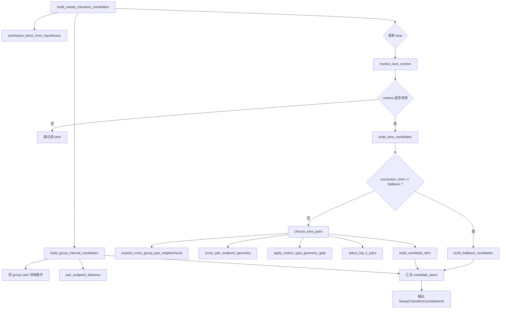
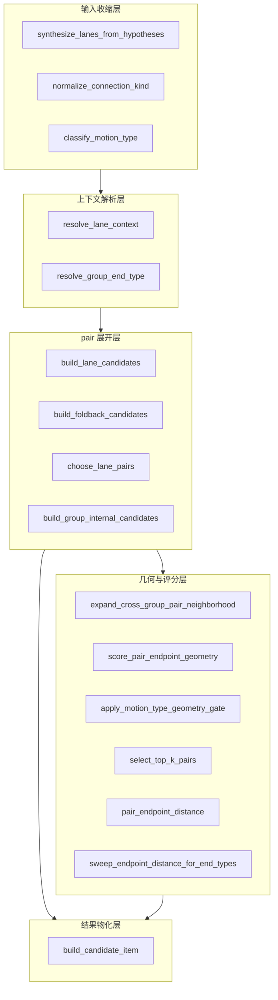
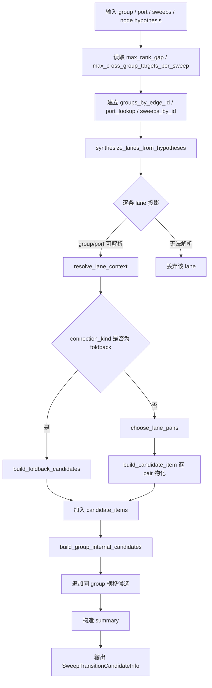
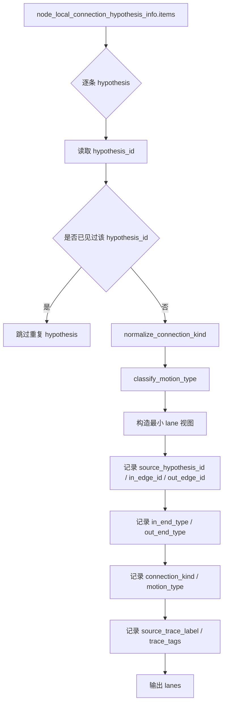
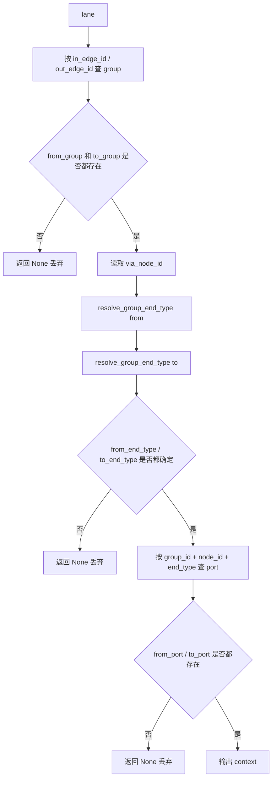
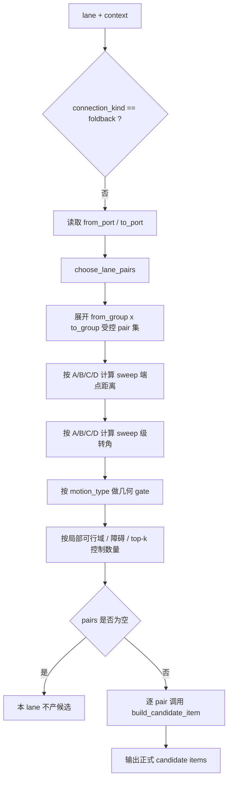
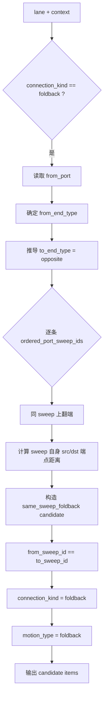
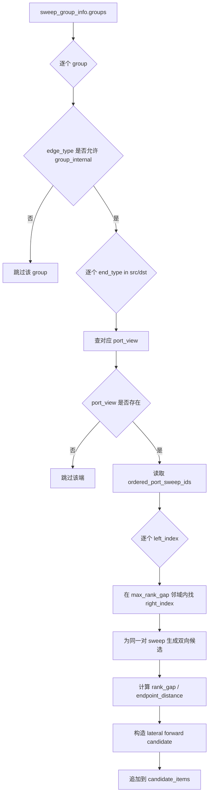

# `build_sweep_transition_candidates` 模块说明

## 1. 模块职责

`build_sweep_transition_candidates(...)` 是 `sweep_graph` 阶段里最核心的候选生成器。

它的职责不是做最终节拍选择，而是把两类上游真值统一展开成 sweep 层正式候选：

1. `node_local_connection_hypothesis_info`
   - 来自 topology 层的节点局部连接真值
   - 先被投影成 lane 视图，再落成 sweep 对之间的正式候选
2. `group_internal` 规则
   - 在同一 coverage lane / 同一 group 内，补充相邻 sweep 的横向正式候选

它的正式输出是：

- `SweepTransitionCandidateInfo.items`
- `SweepTransitionCandidateInfo.summary`

当前实现已经不再保留旧的 reject / weak / fallback 多层筛选树。
主线里只有一层正式候选集合。

---

## 2. 输入与输出

### 2.1 输入

- `sweep_group_info`
  - 每条 coverage lane 对应的 sweep group 真值
  - 提供 `group_id`、`source_edge_id`、`src_node_id`、`dst_node_id`、`ordered_sweep_ids`
- `sweep_port_view_info`
  - 每个 group 在 `src/dst` 端口处的 sweep 排序真值
  - 提供 `ordered_port_sweep_ids` 与 `port_rank_by_sweep_id`
- `sweeps`
  - 正式的 `SweepInfo` 列表
  - 用于读取端点几何和路径信息
- `node_local_connection_hypothesis_info`
  - topology 层下发的节点连接真值
- `config.max_rank_gap`
  - group 内横移候选允许的最大 rank gap
  - 当前默认值为 `2`
  - 运行时最小合法值为 `1`
- `config.max_cross_group_targets_per_sweep`
  - 每个 from sweep 在单条 topology lane 下最多保留的跨 group 几何候选出口数
  - 当前默认值为 `3`
  - 运行时最小合法值为 `1`

### 2.2 输出

- `items`
  - 正式 `SweepTransitionCandidateItem` 元组
- `summary`
  - 当前候选数量与主语义统计

---

## 3. 为什么这个模块需要单独看“函数链”

如果只看普通算法流程图，只能看到：

- 先投影 topology hypothesis
- 再做 lane 上下文解析
- 再生成 candidate
- 再补 group internal 候选

但你真正需要维护代码时，更关心的是：

- `build_sweep_transition_candidates(...)` 下面到底串了哪些函数
- 每个函数到底属于哪一层职责
- 哪些函数在决定主线 pair 展开
- 哪些函数只是做评分、映射或字段物化

所以这个模块最合适用三种视图一起说明：

1. 主调用链图
2. 职责分层图
3. 函数说明表

---

## 4. 主调用链图

这张图回答一件事：

- `build_sweep_transition_candidates(...)` 实际是怎样把子函数串起来的

### 4.1 从调用链上看，主线分为四段

1. 输入收缩
   - `synthesize_lanes_from_hypotheses`
2. lane 上下文解析
   - `resolve_lane_context`
   - `resolve_group_end_type`
3. lane candidate 展开
   - `build_lane_candidates`
   - `build_foldback_candidates`
   - `choose_lane_pairs`
   - `build_candidate_item`
4. group 内横移补充
   - `build_group_internal_candidates`

---

## 5. 职责分层图

这张图不是按执行顺序，而是按函数职责分层。
它回答的是：

- 哪些函数属于“输入整理层”
- 哪些函数属于“上下文解析层”
- 哪些函数属于“pair 展开层”
- 哪些函数属于“评分/物化层”

### 5.1 为什么要这样分层

因为后续改代码时，问题通常不是“整个模块都要改”，而是只落在某一层：

- 如果要改 topology 到 sweep 的字段投影，就改输入收缩层
- 如果要改 src/dst 端口判定，就改上下文解析层
- 如果要改跨 group 多候选展开，就改 pair 展开层
- 如果要改 sweep 端点距离 / 端点转角 / 局部可行性评分，就改几何与评分层
- 如果要改同 group 横移 rank 邻域，就改 group internal 展开层
- 如果要改 candidate 字段结构，就改结果物化层

这比只看一张大流程图更适合维护。

---

## 6. 主流程图

---

## 7. 详细子流程图

### 7.1 从 topology hypothesis 到 lane 视图

这一层的关键点是：

- 先把 topology 对象收缩成 sweep 层最小 lane 视图
- `connection_kind` 在这里已经被收口成：
  - `forward`
  - `foldback`
- 旧语义只保留在 `source_trace_label / trace_tags` 里做追溯

### 7.2 lane 上下文解析

这一层回答的是：

- 这条 topology lane 在当前 sweep 图里能不能落地
- 它落地后对应哪两个 group
- 它在节点哪一端进入、哪一端离开
- 它对应的 port 排序视图是什么

### 7.3 普通 `forward` 候选生成

#### `choose_lane_pairs(...)` 的真实决策口径

`choose_lane_pairs(...)` 是普通跨 group 候选 pair 的生成入口，输出是可供 cadence 选择的多候选集合。

正式口径是：

1. 先读取 `from_port / to_port` 对应的两个 group 和端型。
2. 在 topology hypothesis 许可的 group-pair 内，受控展开 `from_group sweeps x to_group sweeps`。
3. 对每个 pair 按 FinalCoveragePath 的 `A/B/C/D` 端点语义计算 sweep 级几何。
4. 用 `endpoint_distance` 判断端点距离是否合理。
5. 用 `sweep_turn_delta` 判断该 pair 是否符合 `motion_type` 的期望。
6. 用局部可行域、障碍风险和 top-k 限制候选规模。
7. 输出候选集合，允许一个 from sweep 对多个 to sweep，允许一个 to sweep 被多个 from sweep 指向。

跨 group 场景的主规则是 sweep 端点几何召回、`motion_type` 几何校验、局部可行性过滤和 top-k 收口。

跨 group candidate 的左右对应关系来自可验证的 sweep 端点几何和局部连接空间。

当前实现没有建立跨 group rank frame 对齐，因此：

- `rank_gap` 不能作为跨 group 的主排序、主过滤或主收益依据。
- `mean_offset_m / side_level` 不能解释跨 group pair 的左右对应关系。
- 目标 sweep 的 `sweep_role_priority` 只允许在同 group / 同 coverage lane 的共享 frame 内使用；跨 group 时不能作为 pair 几何质量的后置 tie-break。

`motion_type` 的含义也要分清：

- topology 层的 `motion_type` 来自 edge / port 级 `turn_delta_deg_image`。
- 它只说明两个 edge 在 node 处大致是直行、转弯还是折返。
- 具体某个 sweep pair 是否顺，必须再用 sweep 级 `A/B/C/D` 端点角度验证。

### 7.4 `foldback` 候选生成

这一层的关键点是：

- `foldback` 不是两个 sweep 之间做映射
- 它是在同一条 sweep 上，把 `src -> dst` 或 `dst -> src` 翻端
- 因此：
  - `same_sweep = True`
  - `same_edge = True`
  - `rank_gap = 0`

### 7.5 `group_internal` 横移候选生成

#### 哪些 `edge_type` 会进入 `group_internal`

当前接受的 group edge type 是：

- `connected_both_ends`
- `dead_end_one_side`
- `dead_end_both_sides`
- `cycle`

它们在 sweep 层的共同点是：

- 同一 group 内部的 sweep 排序有实际意义
- 同一 group 内部的 `rank_gap / side_level / mean_offset_m` 共享同一 rank frame 和同一中心参考线
- 同端横向移动可以被视为正式局部前进候选

#### `group_internal` 候选的特点

- `candidate_source = group_internal`
- `connection_kind = forward`
- `motion_type = lateral`
- 只在有限 `rank_gap` 邻域内生成
- 同一对相邻 sweep 会展开成双向候选
- `rank_gap` 可以作为 group 内横移风险和代价的重要因子
- `mean_offset_m / side_level` 可以作为 group 内 sweep 角色辅助依据
- group 内横移仍要结合端点距离和局部可行性，不能只看 rank

---

## 8. 函数说明表

| 函数名 | 直接调用者 | 主要作用 | 所属层次 |
| --- | --- | --- | --- |
| `build_sweep_transition_candidates` | `build_sweep_graph_info` | 组织整个 candidate 生成主链 | 入口装配层 |
| `synthesize_lanes_from_hypotheses` | `build_sweep_transition_candidates` | 把 topology hypothesis 收缩成 sweep 层 lane 视图 | 输入收缩层 |
| `normalize_connection_kind` | `synthesize_lanes_from_hypotheses` | 把历史连接语义收口成 `forward / foldback` | 输入收缩层 |
| `classify_motion_type` | `synthesize_lanes_from_hypotheses` | 从 turn delta 推导轻量 motion 语义 | 输入收缩层 |
| `resolve_lane_context` | `build_sweep_transition_candidates` | 把 lane 绑定到 group / port / end_type 真值 | 上下文解析层 |
| `resolve_group_end_type` | `resolve_lane_context` | 决定当前 node 对应 group 的 `src/dst` 端口 | 上下文解析层 |
| `build_lane_candidates` | `build_sweep_transition_candidates` | 为单条 lane 生成正式 candidate 集 | pair 展开层 |
| `choose_lane_pairs` | `build_lane_candidates` | 基于 sweep 端点几何生成跨 group 多候选 pair | pair 展开层 |
| `expand_cross_group_pair_neighborhood` | `choose_lane_pairs` | 在 topology 许可的 group-pair 内受控展开 sweep pair | 几何召回层 |
| `score_pair_endpoint_geometry` | `choose_lane_pairs` | 计算 B/C 距离与 A/B、C/D 端点方向夹角 | 几何评分层 |
| `apply_motion_type_geometry_gate` | `choose_lane_pairs` | 用 sweep 级转角校验 topology 层 motion_type | 几何过滤层 |
| `select_top_k_pairs` | `choose_lane_pairs` | 控制每个 from/to sweep 的候选数量 | 候选收口层 |
| `build_foldback_candidates` | `build_lane_candidates` | 为 same-sweep 回折生成正式候选 | pair 展开层 |
| `build_group_internal_candidates` | `build_sweep_transition_candidates` | 生成 group 内同端横移候选 | pair 展开层 |
| `build_candidate_item` | `build_lane_candidates` | 把 pair 真值物化成正式 candidate 字段 | 结果物化层 |
| `pair_endpoint_distance` | `build_group_internal_candidates` / `build_candidate_item` | 计算两条 sweep 端点距离 | 几何评分层 |
| `sweep_endpoint_distance_for_end_types` | `build_foldback_candidates` | 计算单条 sweep 指定端型之间的距离 | 几何评分层 |
| `distance_rc` | 距离辅助函数 | 计算两个点的欧氏距离 | 几何工具层 |

### 8.1 阅读顺序建议

如果要真正读懂这个模块，建议按下面顺序看：

1. `build_sweep_transition_candidates`
2. `synthesize_lanes_from_hypotheses`
3. `resolve_lane_context`
4. `build_lane_candidates`
5. `choose_lane_pairs`
6. `build_foldback_candidates`
7. `build_group_internal_candidates`
8. `build_candidate_item`

这个顺序对应的是：

- 先看主链装配
- 再看 lane 从哪里来
- 再看 context 怎么落地
- 再看 pair 如何展开
- 最后看字段怎么物化

---

## 9. `build_candidate_item(...)` 真正负责什么

`build_candidate_item(...)` 只负责两件事：

1. 把已经确定好的 pair 真值统一写成正式字段
2. 计算少量轻量评分字段

它不负责：

- 重新改写映射关系
- 再做一轮 lane 真假判断
- 再次决定 connection kind

### 9.1 它会统一写入的关键字段

- `candidate_id`
- `source_topology_lane_id`
- `source_hypothesis_id`
- `candidate_source`
- `via_node_id`
- `from_group_id / to_group_id`
- `from_sweep_id / to_sweep_id`
- `from_end_type / to_end_type`
- `same_sweep / same_edge`
- `connection_kind`
- `motion_type`
- `mapping_type`
- `mapping_pair_index`
- `from_port_rank / to_port_rank`
- `rank_gap`
- `endpoint_distance_px`
- `risk_score`
- `coverage_gain_score`
- `total_score`
- `confidence_score`
- `selection_level`
- `trace_tags / source_trace_label`

### 9.2 当前评分字段的含义

- `rank_gap`
  - 同 group 内端口排序差距
  - 当前没有跨 group rank frame 对齐，因此跨 group 默认不具备几何对应意义
- `risk_score`
  - 由端点距离、sweep 级转角、局部可行域、障碍风险等共同决定
  - 跨 group 场景以 sweep 级几何和局部可行性为主
- `coverage_gain_score`
  - 表达该候选对后续覆盖推进的收益
  - 跨 group 收益由覆盖推进、连接可行性和路径连续性共同决定
- `total_score`
  - 表达端点距离、sweep 端点转角、局部可行性、风险与收益的综合代价
  - 跨 group 排序必须以 sweep 级几何和可行性为主
  - 目标 sweep 的 `mean_offset_m / side_level` 不属于跨 group pair 连接质量，不能在跨 group 排序或 connector 成本中使用

---

## 10. 模块边界

### 10.1 这个模块负责什么

- 把 topology hypothesis 投影成 sweep 候选
- 补充 group 内横移候选
- 输出唯一正式候选集合

### 10.2 这个模块不负责什么

- 不负责最终 cadence 选择
- 不负责 route 合并与修补
- 不负责 final path connector 几何
- 不负责 reject / fallback 多层旧树结构

---

## 11. 一句话总结

`build_sweep_transition_candidates(...)` 的本质是：

- 先把 topology 层的“边级连接意图”投影成 sweep pair
- 再补充少量同 group 横移候选
- 最后输出一层正式、可直接进入 cadence 的 `sweep_transition_candidate_info`
