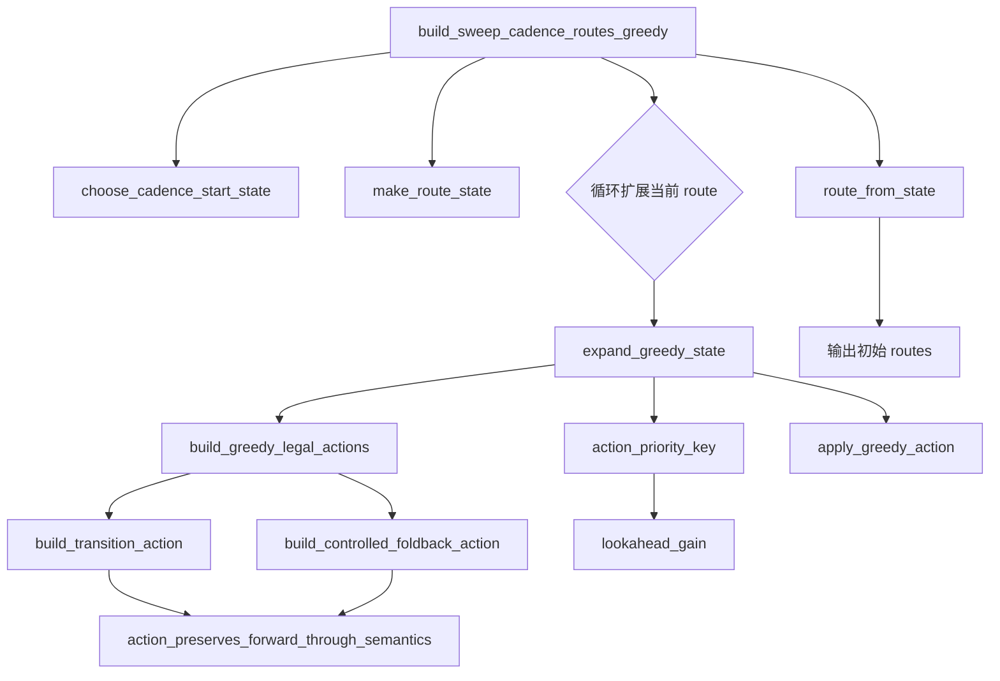
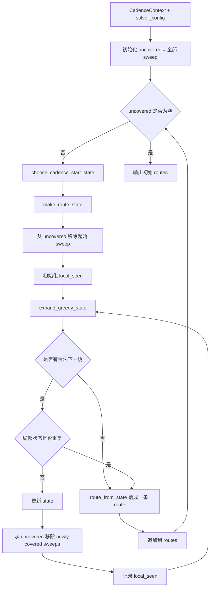
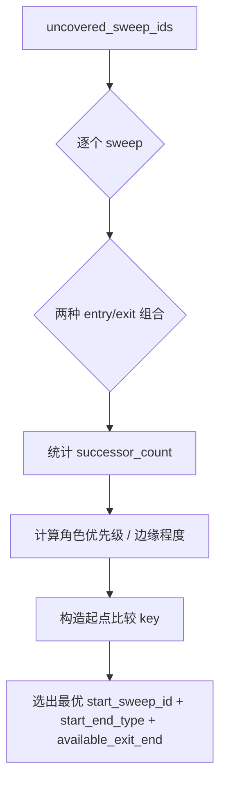
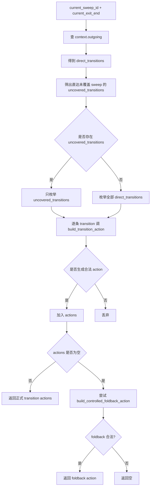
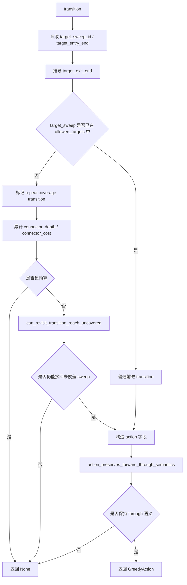
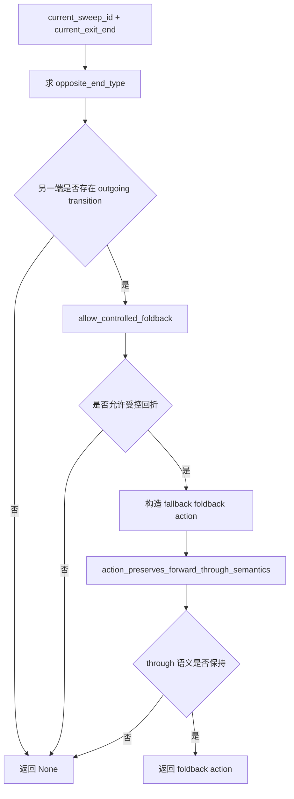
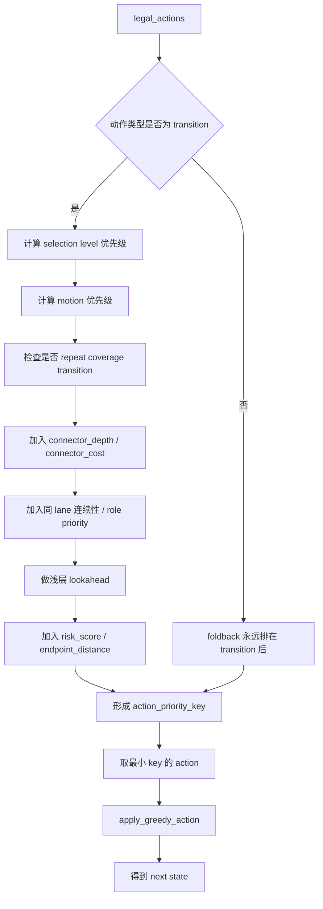
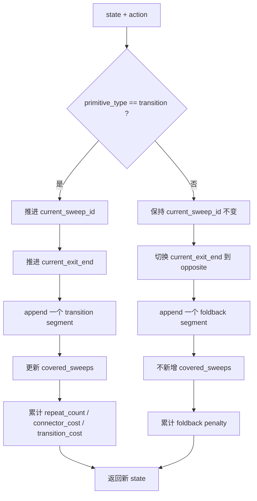

# `greedy 生成初始 routes` 模块说明

## 1. 模块职责

这里说的“greedy 生成初始 routes”，对应的是 `sweep_cadence` 阶段的主求解链，核心落点在：

- `build_sweep_cadence_routes_greedy(...)`
- `expand_greedy_state(...)`
- `build_greedy_legal_actions(...)`
- `build_transition_action(...)`
- `build_controlled_foldback_action(...)`
- `apply_greedy_action(...)`
- `action_priority_key(...)`

这条链的职责是：

1. 从全局未覆盖 sweep 集中选起点
2. 在当前出口枚举所有合法动作
3. 用统一排序键挑选当前最优动作
4. 把动作真正写入 route state
5. 持续扩展直到当前 route 不能再扩
6. 再从剩余未覆盖 sweep 中开启下一条 route

它的目标不是一次求全局最优，而是先保证：

- 每个 sweep 至少被首次覆盖一次
- 初始 cadence route 集合完整可用
- 后续 repair / absorb / merge 还有明确整理空间

---

## 2. 输入与输出

### 2.1 输入

- `CadenceContext`
  - `sweeps`
  - `transitions`
  - `sweep_by_id`
  - `node_by_id`
  - `outgoing`
- `solver_config`
  - 连接器深度限制
  - 连接器成本限制
  - foldback 风险限制等

### 2.2 输出

- 初始 `list[SweepCadenceRoute]`

这些 route 还不是最终收尾结果，后面还会进入：

- merge
- absorb singleton
- endpoint repair

---

## 3. 为什么这个模块需要单独看“函数链”

如果只看普通算法流程图，只能看到：

- 先选起点
- 再枚举动作
- 再排序
- 再推进状态
- 最后得到 route

但实际维护代码时，更关键的是：

- greedy 主求解到底由哪些函数串起来
- 哪些函数在做 legality 过滤
- 哪些函数在做排序
- 哪些函数在做状态推进
- 哪些函数只是在提供上下文和辅助语义

所以这个模块也最适合用三种视图一起说明：

1. 主调用链图
2. 职责分层图
3. 函数说明表

---

## 4. 主调用链图

这张图回答一件事：

- `build_sweep_cadence_routes_greedy(...)` 实际是怎样把子函数串起来的

### 4.1 从调用链上看，主线分为四段

1. 起始状态构造
   - `choose_cadence_start_state`
   - `make_route_state`
2. 合法动作枚举
   - `build_greedy_legal_actions`
   - `build_transition_action`
   - `build_controlled_foldback_action`
3. 动作排序与状态推进
   - `action_priority_key`
   - `lookahead_gain`
   - `apply_greedy_action`
4. route 落盘与外层循环
   - `route_from_state`
   - `build_sweep_cadence_routes_greedy`

---

## 5. 职责分层图

这张图不是按执行顺序，而是按函数职责分层。
它回答的是：

- 哪些函数属于“起点选择层”
- 哪些函数属于“动作构造层”
- 哪些函数属于“合法性与 reachability 层”
- 哪些函数属于“排序层”
- 哪些函数属于“状态推进与结果落盘层”

```mermaid
flowchart LR
    subgraph A[起点选择层]
        A1[choose_cadence_start_state]
        A2[make_route_state]
    end

    subgraph B[动作构造层]
        B1[build_greedy_legal_actions]
        B2[build_transition_action]
        B3[build_controlled_foldback_action]
    end

    subgraph C[合法性与可达性层]
        C1[action_preserves_forward_through_semantics]
        C2[can_revisit_transition_reach_uncovered]
        C3[allow_controlled_foldback]
    end

    subgraph D[排序层]
        D1[action_priority_key]
        D2[lookahead_gain]
        D3[transition_penalty]
    end

    subgraph E[状态推进与结果层]
        E1[apply_greedy_action]
        E2[route_from_state]
        E3[build_sweep_cadence_routes_greedy]
    end

    A --> B --> D --> E
    B --> C --> D
```

### 5.1 为什么要这样分层

因为后续改代码时，问题通常只落在某一层：

- 如果要改 route 起点选择，就改起点选择层
- 如果要改哪些 transition 能被枚举，就改动作构造层
- 如果要改重复覆盖连接器和 foldback 约束，就改合法性与可达性层
- 如果要改 greedy 偏好，就改排序层
- 如果要改 route state 字段和段落盘，就改状态推进与结果层

---

## 6. 主流程图

---

## 7. 详细子流程图

### 7.1 起始 sweep 选择

### 7.2 合法动作枚举

### 7.3 `build_transition_action(...)` 的细流程

### 7.4 `build_controlled_foldback_action(...)` 的细流程

### 7.5 动作排序与单步扩展

### 7.6 `apply_greedy_action(...)` 的细流程

---

## 8. 函数说明表

| 函数名 | 直接调用者 | 主要作用 | 所属层次 |
| --- | --- | --- | --- |
| `build_sweep_cadence_routes_greedy` | `build_sweep_cadence` | greedy 外层主循环，负责生成全部初始 routes | 入口装配层 |
| `choose_cadence_start_state` | `build_sweep_cadence_routes_greedy` | 从未覆盖 sweep 中选择当前 route 起点 | 起点选择层 |
| `make_route_state` | `build_sweep_cadence_routes_greedy` / `lookahead_gain` | 构造统一的 solver 过程态 | 状态初始化层 |
| `expand_greedy_state` | `build_sweep_cadence_routes_greedy` | 为当前 state 选择并应用一跳最优动作 | 单步扩展层 |
| `build_greedy_legal_actions` | `expand_greedy_state` / `lookahead_gain` | 枚举当前 state 的全部合法动作 | 动作构造层 |
| `build_transition_action` | `build_greedy_legal_actions` | 把正式 transition 翻译成 greedy action | 动作构造层 |
| `build_controlled_foldback_action` | `build_greedy_legal_actions` | 构造 solver 层兜底 foldback 动作 | 动作构造层 |
| `action_preserves_forward_through_semantics` | `build_transition_action` / `build_controlled_foldback_action` | 检查动作是否破坏 through 语义 | 合法性层 |
| `can_revisit_transition_reach_uncovered` | `build_transition_action` | 检查重复覆盖连接器能否重新接回未覆盖 sweep | 可达性层 |
| `allow_controlled_foldback` | `build_controlled_foldback_action` | 判断是否允许受控回折 | 可达性层 |
| `action_priority_key` | `expand_greedy_state` | 给合法动作生成稳定排序键 | 排序层 |
| `lookahead_gain` | `action_priority_key` | 提供后继潜力的浅层证据 | 排序层 |
| `transition_penalty` | `apply_greedy_action` | 给 transition 动作累计 route 代价 | 评分层 |
| `apply_greedy_action` | `expand_greedy_state` / `action_preserves_forward_through_semantics` | 把动作真正写入 route state | 状态推进层 |
| `route_from_state` | `build_sweep_cadence_routes_greedy` | 把 solver state 压平成正式 route | 结果物化层 |

### 8.1 阅读顺序建议

如果要真正读懂这个模块，建议按下面顺序看：

1. `build_sweep_cadence_routes_greedy`
2. `choose_cadence_start_state`
3. `expand_greedy_state`
4. `build_greedy_legal_actions`
5. `build_transition_action`
6. `build_controlled_foldback_action`
7. `action_priority_key`
8. `apply_greedy_action`
9. `route_from_state`

这个顺序对应的是：

- 先看 greedy 主循环
- 再看起点如何产生
- 再看一跳怎么扩
- 再看动作怎样被构造和排序
- 最后看状态和 route कैसे落盘

---

## 9. 模块边界

### 9.1 这个模块负责什么

- 从正式 transition candidate 中选择初始 route
- 保证全部 sweep 至少被首次覆盖一次
- 维护 route state 的统一真值
- 控制重复覆盖连接器与 foldback 的使用边界

### 9.2 这个模块不负责什么

- 不负责 singleton 吸收
- 不负责 route 之间的合并收尾
- 不负责 endpoint repair
- 不负责 final path 几何连接

这些都属于 greedy 之后的后处理阶段。

---

## 10. 一句话总结

“greedy 生成初始 routes”的本质是：

- 站在全局未覆盖 sweep 集上
- 每次只做一跳稳定、可解释的局部最优选择
- 先把覆盖骨架 route 集合搭起来
- 把结构修整交给后续 repair / absorb / merge
