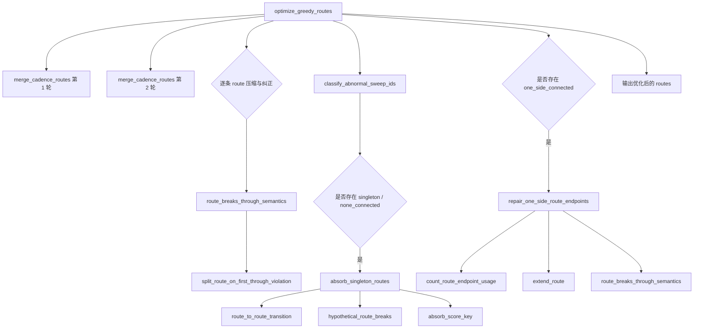
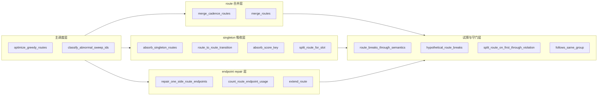
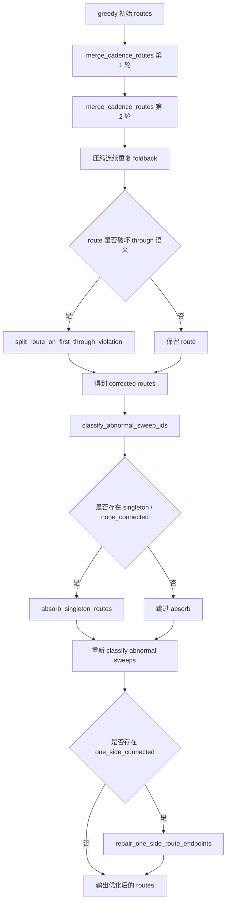
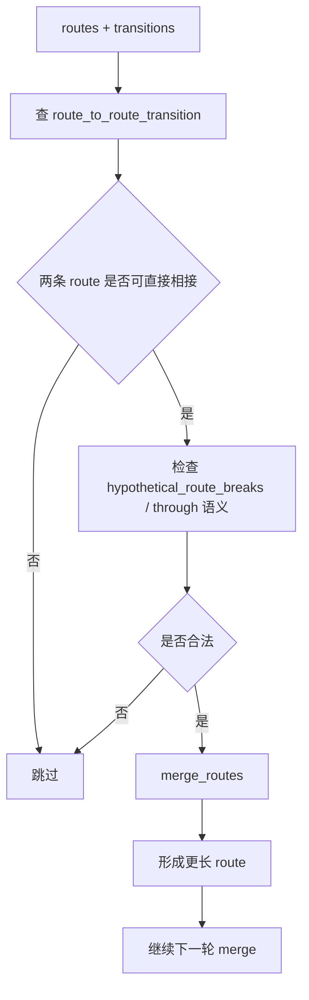
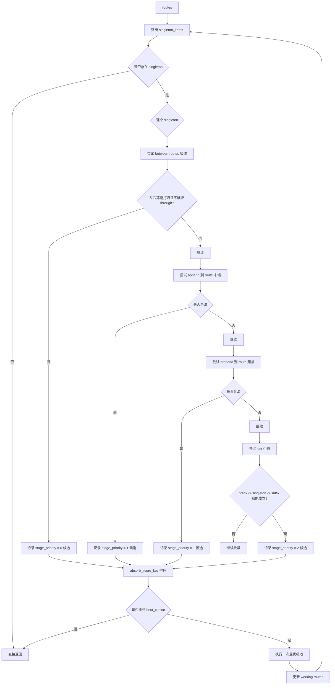
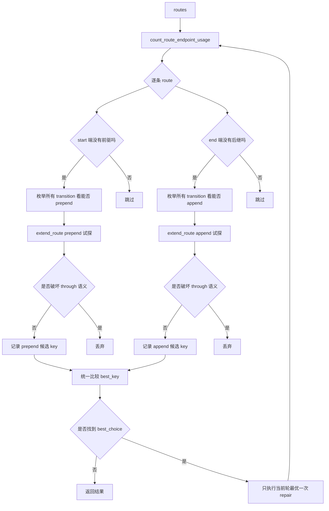
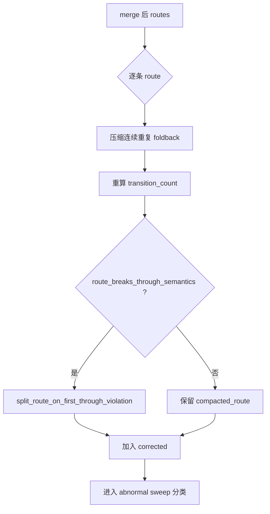

# `route repair / absorb / merge` 模块说明

## 1. 模块职责

这里说的 `route repair / absorb / merge`，对应的是 `sweep_cadence` 里 greedy 初始 routes 之后的后处理主链，核心落点在：

- `optimize_greedy_routes(...)`
- `merge_cadence_routes(...)`
- `absorb_singleton_routes(...)`
- `repair_one_side_route_endpoints(...)`

它的职责不是重新求解 sweep 覆盖顺序，而是基于已经生成好的初始 routes 和正式 transition 真值，尽量把碎片化结构收敛成更完整、更稳定的 route 集合。

这条后处理链解决的主要问题有三类：

1. `merge`
   - 本来就可以自然拼起来的 route，先并成长 route
2. `absorb`
   - singleton route 或 none-connected 异常 sweep，尽量吸进已有 route
3. `repair`
   - 只连到一侧的 route，尽量补齐首尾缺口

---

## 2. 输入与输出

### 2.1 输入

- `routes`
  - 来自 greedy 主求解的初始 route 集
- `context.transitions`
  - 正式 `SweepTransitionCandidateItem` 集合
- `context.sweep_by_id`
  - sweep 查表
- `cadence_context`
  - 用于 through 语义与可达性检查

### 2.2 输出

- 优化后的 `list[SweepCadenceRoute]`

这些 route 已经比 greedy 初始结果更完整，但仍然属于 cadence 阶段结果，不是 final path。

---

## 3. 为什么这个模块需要单独看“函数链”

如果只看普通流程图，只能看到：

- 先 merge
- 再 absorb singleton
- 最后 repair endpoint

但真正维护代码时，更关键的是：

- 这条后处理主链到底由哪些函数组成
- 哪些函数在做 route 合并
- 哪些函数在做 singleton 吸收
- 哪些函数在做端点修补
- 哪些函数只是做结构试探、排序和 through 语义检查

所以这个模块也最合适用三种视图一起说明：

1. 主调用链图
2. 职责分层图
3. 函数说明表

---

## 4. 主调用链图

这张图回答一件事：

- `optimize_greedy_routes(...)` 实际是怎样把子函数串起来的

### 4.1 从调用链上看，主线分为四段

1. route 合并
   - `merge_cadence_routes`
2. route 清洗与 through 违规切分
   - `route_breaks_through_semantics`
   - `split_route_on_first_through_violation`
3. singleton 吸收
   - `absorb_singleton_routes`
   - `route_to_route_transition`
   - `hypothetical_route_breaks`
   - `absorb_score_key`
4. 端点修补
   - `repair_one_side_route_endpoints`
   - `count_route_endpoint_usage`
   - `extend_route`

---

## 5. 职责分层图

这张图不是按执行顺序，而是按函数职责分层。
它回答的是：

- 哪些函数属于“主调度层”
- 哪些函数属于“route 合并层”
- 哪些函数属于“singleton 吸收层”
- 哪些函数属于“endpoint repair 层”
- 哪些函数属于“试探与守门层”

### 5.1 为什么要这样分层

因为后续改代码时，问题通常只落在某一层：

- 如果要改大结构的收尾顺序，就改主调度层
- 如果要改 route 怎么自然拼接，就改 route 合并层
- 如果要改 singleton 怎么被吸收，就改 singleton 吸收层
- 如果要改单侧悬空 route 怎么补齐，就改 endpoint repair 层
- 如果要改 through 语义守门，就改试探与守门层

---

## 6. 总流程图

---

## 7. 详细子流程图

### 7.1 `merge_cadence_routes(...)` 在这条链里的角色

### 7.2 `absorb_singleton_routes(...)` 主流程

### 7.3 `repair_one_side_route_endpoints(...)` 主流程

### 7.4 `optimize_greedy_routes(...)` 中间整理步骤

---

## 8. 函数说明表

| 函数名 | 直接调用者 | 主要作用 | 所属层次 |
| --- | --- | --- | --- |
| `optimize_greedy_routes` | `build_sweep_cadence` | 后处理总入口，组织 merge / absorb / repair 顺序 | 主调度层 |
| `merge_cadence_routes` | `optimize_greedy_routes` | 合并天然可拼接的 route | route 合并层 |
| `merge_routes` | `merge_cadence_routes` / `absorb_singleton_routes` | 把两条 route 用一条 transition 串成一条长 route | route 结构层 |
| `route_breaks_through_semantics` | `optimize_greedy_routes` / `repair_one_side_route_endpoints` | 检查 route 是否破坏 through 语义 | 守门层 |
| `split_route_on_first_through_violation` | `optimize_greedy_routes` | 把 through 违规 route 切成合法片段 | 守门层 |
| `classify_abnormal_sweep_ids` | `optimize_greedy_routes` | 识别 singleton / none_connected / one_side_connected sweep | 主调度层 |
| `absorb_singleton_routes` | `optimize_greedy_routes` | 把 singleton route 吸进已有 route | singleton 吸收层 |
| `route_to_route_transition` | `absorb_singleton_routes` / `merge_cadence_routes` | 查询两条 route 之间是否存在正式 transition | 试探层 |
| `hypothetical_route_breaks` | `absorb_singleton_routes` / `merge_cadence_routes` | 试探合并后是否破坏 through 语义 | 试探层 |
| `absorb_score_key` | `absorb_singleton_routes` | 给 between / append / prepend / slot 吸收动作排序 | 排序层 |
| `split_route_for_slot` | `absorb_singleton_routes` | 为 slot 中插拆出 prefix / suffix | route 结构层 |
| `repair_one_side_route_endpoints` | `optimize_greedy_routes` | 修补只连到一侧的 route 首尾端点 | endpoint repair 层 |
| `count_route_endpoint_usage` | `repair_one_side_route_endpoints` | 统计 route 起终点被其他 route 占用情况 | endpoint repair 层 |
| `extend_route` | `repair_one_side_route_endpoints` | 把 transition prepend / append 到 route 首尾 | route 结构层 |
| `follows_same_group` | repair / absorb 排序逻辑 | 判断连接是否保持同组连续性 | 排序辅助层 |

### 8.1 阅读顺序建议

如果要真正读懂这个模块，建议按下面顺序看：

1. `optimize_greedy_routes`
2. `merge_cadence_routes`
3. `route_breaks_through_semantics`
4. `classify_abnormal_sweep_ids`
5. `absorb_singleton_routes`
6. `repair_one_side_route_endpoints`
7. `merge_routes` / `extend_route` / `split_route_for_slot`

这个顺序对应的是：

- 先看总调度顺序
- 再看大结构如何先 merge
- 再看 through 违规如何切分
- 再看 singleton 怎么吸收
- 最后看 endpoint 怎么修补

---

## 9. 模块边界

### 9.1 负责什么

- 合并天然可拼的 route
- 吸收 singleton 和 none-connected 异常 sweep
- 修补单侧悬空 route endpoint
- 清理重复 foldback 和 through 违规段

### 9.2 不负责什么

- 不重新生成 sweep transition candidate
- 不重新跑 greedy 主求解
- 不决定 final path connector 几何
- 不改写 sweep 本体几何

---

## 10. 一句话总结

`route repair / absorb / merge` 的本质是：

- 在不重跑主求解的前提下
- 用正式 transition 真值把初始 greedy routes 继续整理干净
- 让 route 集从“能覆盖”收敛到“结构更完整、更稳定、更适合 final path 物化”
