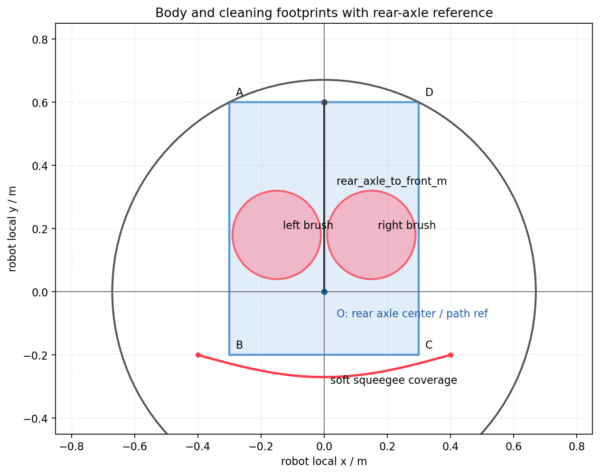

# 后轴参考点几何与清扫覆盖对两种正式方案的影响分析

## 1. 背景

覆盖路径进入 UI 主线后，不能只用路径中心线、转角数量、线距均匀性或中心线 buffer 覆盖率评价。对于以后轴中心作为路径参考点的清洁机器人，必须把路径评价拆成三类问题：

- 车体能不能安全通过；
- 清扫部件是否真实覆盖目标区域；
- 中心线指标与真实车体/清扫 footprint 指标之间是否存在偏差。

其中 `rear_axle_to_front_m` 表示后轴中心到车体前向边界的距离。路径点如果表示后轴中心，车体前角、盘刷和刮水器会在转弯、掉头、靠边、斜插和路口连接时产生额外扫掠。后轴中心轨迹可通行，不等价于整车 footprint 可通行。

本文只分析 UI 中需要关注的两种正式方案：

- `shelfAware`；
- `ShelfAware+TurnCost`。

不分析已经归档的 smoke baseline、旧对外 mode、完整官方 turn_cost 复现流程或研究态批量后处理。

## 2. 几何示意

下图是工程化示意，展示后轴参考点、刚性车体 footprint、盘刷 footprint 和刮水器软覆盖范围之间的关系。图中尺寸只用于说明结构关系，正式诊断必须使用机器人实测标定参数。

图中含义：

- `O`：后轴中心，作为路径参考点的推荐定义。
- `rear_axle_to_front_m`：后轴中心到车体前向边界的距离。
- 蓝色矩形：刚性车体 footprint，用于硬碰撞检查。
- 红色圆：左右盘刷 footprint，用于清扫覆盖定义。
- 红色弧线：刮水器软覆盖范围，允许横向超出车体宽度；当前契约不参与硬碰撞，可参与覆盖定义。
- 灰色圆：以后轴中心为圆心覆盖车体最远点的保守外接圆，仅用于解释几何外扫，不建议替代矩形 swept footprint。
- 生成脚本：`tools/生成机器人几何示意图.py`。真实尺寸确认后应通过脚本重生成图片。

## 3. 核心判断

`turn cost` 不等价于 `footprint swept collision`，`coverage_width_m` 也不等价于真实清扫覆盖。

转角代价通常表达：

- 减少转弯次数；
- 避免大角度急转；
- 偏好方向连续；
- 减少局部折返。

机器人几何约束表达：

- 路径参考点可能是后轴中心，而不是车体几何中心；
- 后轴中心轨迹不碰撞，不代表车体前角不碰撞；
- 沿折线路径平移采样不足以覆盖转弯过程，需要对急转和掉头做 yaw 插值扫掠检查；
- 靠墙、掉头、路口、斜插时，需要检查刚性车体矩形 swept footprint；
- 真实覆盖应由盘刷、刮水器等清扫部件的 swept footprint 定义；
- 刮水器按软覆盖部件处理，不进入硬碰撞检查。

因此，一个方案的路径可能转角更少，但仍然存在车体扫掠碰撞；也可能中心线 buffer 覆盖率较高，但真实清扫 footprint 存在漏扫。

## 4. 对 `shelfAware` 的影响

### 4.1 优势

`shelfAware` 的优势是：

- 能利用局部方向；
- 能贴合货架、走廊、障碍结构；
- 覆盖率通常较高；
- 可以结合 CTG territory / junction 辅助；
- 有质量守卫和部分长跳跃治理。

### 4.2 风险

`shelfAware` 仍以离散节点和折线连接为主。它考虑了机器人宽度、覆盖宽度、障碍膨胀和转角惩罚，但没有严格建模以后轴中心为参考点的矩形车体扫掠，也没有使用盘刷和刮水器真实清扫 footprint 计算覆盖。

风险集中在：

- coverage lane 端部掉头时，后轴中心轨迹不碰障，但车体前角可能扫障；
- 两条 lane 之间的短连接可能让车体矩形外扫；
- 路口区连续多段折线可能造成车体扫掠重叠障碍；
- 跨段转移或斜插后可能让前端越过障碍边界；
- 窄通道内中心线可通行，但车体矩形姿态变化后不可通行；
- 小回折和短距离折返会放大后轴参考点带来的前端扫掠风险；
- 路径中心线 buffer 可能不能代表盘刷和刮水器的真实覆盖。

### 4.3 初步结论

`shelfAware` 可以作为稳定覆盖路径入口，但不能只用中心线覆盖率证明其适合下游执行链路。

增加机器人几何和清扫 footprint 后，`shelfAware` 需要通过同一套只读诊断识别：

- 车体平移扫掠是否碰撞或紧贴；
- 转弯/掉头 yaw 插值扫掠是否碰撞或紧贴；
- 真实清扫 footprint 是否漏扫；
- 中心线 buffer 覆盖率是否高估或低估真实清扫覆盖。

## 5. 对 `ShelfAware+TurnCost` 的影响

### 5.1 优势

`ShelfAware+TurnCost` 正式入口的核心行为是：

- 保留 shelfAware 主路径组织链路；
- 使用 `turn_cost_repaired_grid` 作为覆盖节点生成方式；
- 关闭孤立跳变治理；
- 优先尝试 CTG auxiliary；
- CTG auxiliary 不可用时记录失败并继续生成路径。

观察到的优势是：

- 规则节点使局部 lane spacing 更稳定；
- 覆盖线更接近规则 coverage strip；
- 视觉形态通常比 `shelfAware` 更整齐；
- 相比 `shelfAware`，转角和局部混乱通常更少；
- 在现有保留项目全区域可以生成路径。

### 5.2 风险

`ShelfAware+TurnCost` 仍然没有直接约束车体矩形 swept footprint 和真实清扫 footprint。

turn-cost 风格节点生成和方向偏好只能间接减少折线混乱与线距不均，不能保证：

- 后轴中心路径执行时，车体前角不会扫到障碍；
- 转弯或掉头的连续 yaw 变化过程不碰撞；
- 斜向连接段不会因为前向几何偏置产生越界；
- 盘刷和刮水器扫掠区域能连续覆盖目标区域；
- 窄通道中的 lane 切换同时满足车体通过和清扫覆盖。

### 5.3 初步结论

`ShelfAware+TurnCost` 更适合作为真实机器人几何诊断的候选方案，因为路径结构更规整，便于做 footprint 扫掠诊断和清扫覆盖诊断。

但它不能默认满足车体扫掠约束，也不能只凭 lane spacing 更均匀就认定真实覆盖更好。它仍需要通过与 `shelfAware` 相同的几何与覆盖诊断。

## 6. 两种方案对比

| 维度 | shelfAware | ShelfAware+TurnCost |
|---|---|---|
| 中心线覆盖率 | 通常较高 | 通常较高 |
| 线距均匀性 | 容易局部不均 | 明显改善 |
| 路口区形态 | 容易出现复杂连接 | 有改善，但仍可能混乱 |
| 长跳跃 | 可通过治理降低 | 较稳定 |
| 总转角 | 不一定低 | 通常更低 |
| 规则 coverage strip | 较弱 | 更强 |
| 平移扫掠可执行性 | 未证明 | 未证明 |
| 转弯/掉头扫掠可执行性 | 未证明 | 未证明 |
| 真实清扫覆盖 | 未证明 | 未证明 |
| UI 定位 | 稳定入口 | 独立研究入口 |
| 是否应自动推荐 | 可保留现有策略 | 暂不建议进入 auto |

## 7. 只读诊断主线

几何诊断在当前工程中保持只读；任何路径修改都必须另立设计、输入契约和验收标准，不能由诊断脚本直接回写路径。

诊断判定层只看场景无关指标：

- 车体平移扫掠硬碰撞；
- 车体平移扫掠紧贴障碍；
- 转弯/掉头 yaw 插值扫掠硬碰撞；
- 转弯/掉头 yaw 插值扫掠紧贴障碍；
- 真实清扫 footprint 覆盖率；
- 真实清扫 footprint 漏扫面积；
- 中心线 buffer 覆盖与真实清扫覆盖差异；
- 急转、连续折线、局部方向突变窗口。

本文只定义几何诊断主线，不展开路径语义归因。解释问题来源或制定优化策略时，应在诊断结果之外另行建立归因层。

## 8. 规则依据与边界

只读诊断不是新的覆盖路径算法，也不是复杂运动学规划器。它的依据来自三层：

1. 当前工程已有路径质量口径。`quality_guard.py` 已经统计 3 点转角、总转角、长跳和不可行段；`path_postprocess.py` 已经包含短距离大转角、短锯齿、跳变分段和虚线跳变渲染；`candidate_scoring.py` 已经在候选评分中纳入移动距离、转向代价和转角硬约束。因此，急转、短折线、长跳和转角窗口不是凭空新增概念。
2. 移动机器人导航工程普遍使用 footprint 与 costmap 做碰撞检查。路径中心点可通行不等于机器人 footprint 可通行，尤其在后轴参考点、矩形车体和窄通道场景中更明显。本文只把这个原则用于离线只读诊断，不替代控制器和在线避障。
3. 覆盖路径与清扫机器人场景需要区分“中心线覆盖”和“真实清扫部件覆盖”。`coverage_width_m` buffer 适合快速比较，但不能表达盘刷和刮水器的真实扫掠范围。

本文不直接采用外部文献或通用导航框架里的默认阈值。诊断阈值必须优先由当前工程参数推导，包括地图分辨率、路径点间距、`coverage_width_m`、`robot_width_m`、既有障碍膨胀结果和当前 turn constraint 参数。

诊断结果的边界如下：

- 平移 swept footprint 和 yaw 插值 swept footprint 只能说明“按当前离散路径和姿态假设存在几何风险”，不是底盘控制器真实轨迹的证明。
- 如果控制器后续会做平滑、限曲率、倒车或原地旋转，应在诊断元数据里记录运动模型假设，并在实车或仿真执行链路中复核。
- 只读诊断发现风险后，不自动修改路径；路径优化必须另行设计守卫，避免为了降低某个风险引入漏扫、长跳或线距恶化。

## 9. 可视化原则

可视化应避免颜色语义冲突，保证路径本身始终可读。

建议拆成多张图，而不是把所有信息堆在一张图里：

- 路径 + 车体平移扫掠风险；
- 路径 + 转弯/掉头扫掠风险；
- 清扫 footprint 覆盖与漏扫；
- 中心线 buffer 与真实清扫覆盖差异；
- 局部风险窗口放大图。

颜色和图层原则：

- 原路径使用高对比蓝色实线，不添加描边；
- 车体普通采样 footprint 使用青色实线细框；
- `hard_collision` 使用正红色实线矩形框加红色圆点；
- `tight_clearance` 使用洋红色虚线矩形框；
- 清扫漏扫使用黄色实心栅格区域，并单独成图；
- 盘刷覆盖使用绿色实心栅格区域，并单独成图；
- 刮水器覆盖使用蓝色实心栅格区域，并单独成图；
- 所有诊断符号、路径线和栅格覆盖层均使用 `opacity=1`。
- 图例写到图上的内容必须真实绘制，不能出现文档有但图中没有的符号。

## 10. 结论

- `shelfAware` 是稳定入口，但还不能证明满足后轴参考点下的车体 footprint 扫掠约束。
- `ShelfAware+TurnCost` 的路径结构更规整，更适合进入真实机器人几何诊断，但也不能默认满足车体扫掠和真实清扫覆盖要求。
- `turn cost` 只能作为减少转向复杂度的间接指标，不能替代车体 footprint 扫掠诊断。
- `coverage_width_m` 是清扫覆盖的简化近似，不能替代盘刷和刮水器的真实清扫 footprint。
- 完整只读诊断和同口径对比报告是路径生成或局部优化硬约束化的前置条件。

## 11. 非目标

本文不做以下事情：

- 不直接修改 `shelfAware` 路径生成；
- 不直接修改 `ShelfAware+TurnCost` 节点生成；
- 不把 Dubins / Reeds-Shepp 曲线接入正式路径；
- 不迁入研究态批量候选重连；
- 不根据单个 area 做专用补丁；
- 不把 `ShelfAware+TurnCost` 加入 `auto` 自动推荐。
