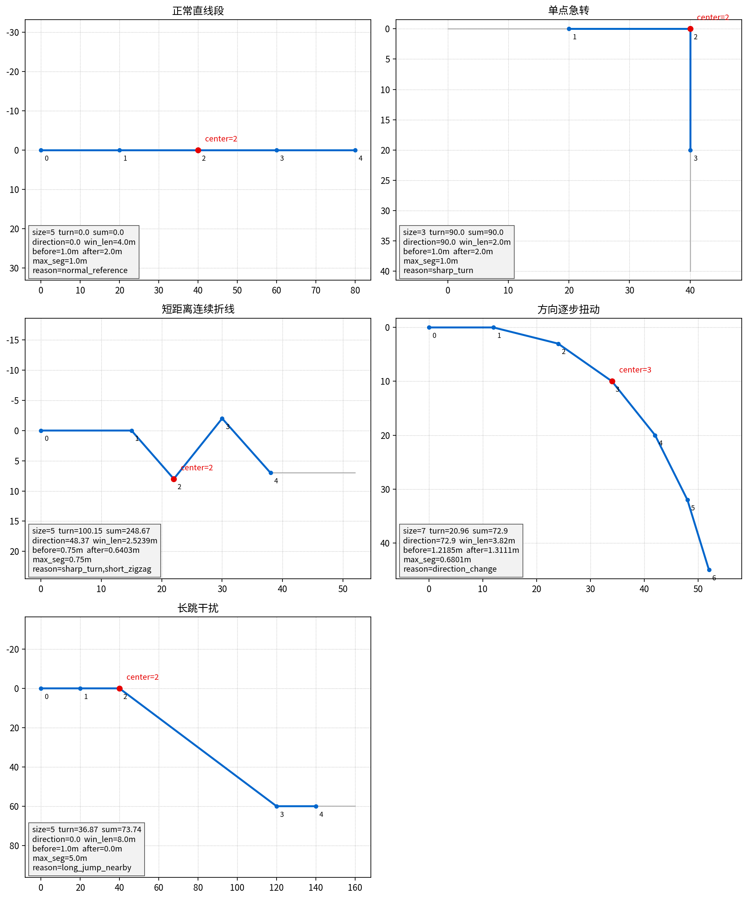
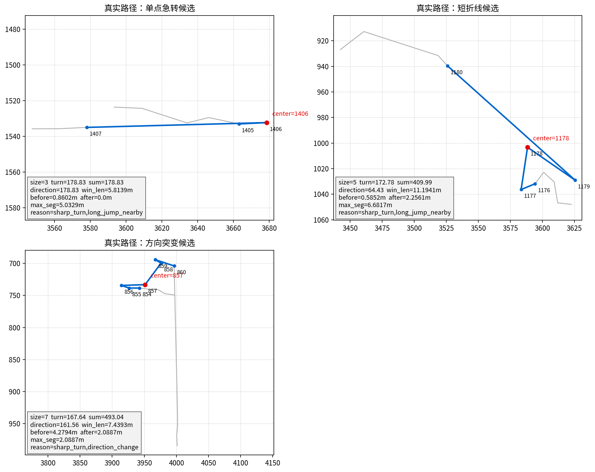

# 转角窗口字段计算说明

## 1. 目标

本文解释风险窗口 JSON 中各字段的计算语义，重点说明这些字段如何组合判断不同路径形态。

本文不是新的路径优化方案，也不是把单个字段当作质量结论。转角窗口只负责把路径局部形态描述清楚，是否真的存在车体执行风险，还要继续看平移 swept footprint 和 yaw 插值 swept footprint 诊断。

配套脚本：

```bash
python3 algorithms/turn_cost_coverage_research/docs/01_主题/03_机器人几何与覆盖定义/tools/生成转角窗口字段说明图.py
```

脚本输出：

- `assets/转角窗口字段_示意场景.png`
- `assets/转角窗口字段计算案例.json`

如需生成真实路径窗口，可显式传入路径点 JSON：

```bash
python3 algorithms/turn_cost_coverage_research/docs/01_主题/03_机器人几何与覆盖定义/tools/生成转角窗口字段说明图.py \
  --path-pixels <path_pixels.json>
```

真实路径只作为说明字段计算的代表案例，不作为算法优劣结论。主题文档不得绑定某个历史 run；需要保留真实路径证据时，应放入 `05_验证/当前基线/` 或 output 资产索引。

## 2. 基础定义

路径点记为：

```text
p[0], p[1], p[2], ...
```

相邻两点方向：

```text
heading(a,b) = atan2(b.y - a.y, b.x - a.x)
```

单点转角：

```text
turn_delta(i) = normalize(heading(p[i], p[i+1]) - heading(p[i-1], p[i]))
```

其中 `normalize` 把角度归一到 `[-180, 180]`，避免 359 度和 -1 度被误认为大转角。

窗口内路径长度：

```text
window_length_m =
  sum(distance(p[k], p[k+1])) * resolution_m
```

其中 `distance(p[k], p[k+1])` 是相邻两个路径点在图像坐标系里的二维欧式距离：

```text
distance(p[k], p[k+1]) =
  sqrt((p[k+1].x - p[k].x)^2 + (p[k+1].y - p[k].y)^2)
```

如果路径点是像素坐标，`distance` 的单位就是 `px`。

`sum(...)` 表示把窗口内每一段相邻路径点距离累加。它不是窗口起点到终点的直线距离，而是窗口内折线路径长度。例如 5 点窗口 `p[10] ... p[14]`：

```text
window_length_m =
  (
    distance(p[10], p[11])
  + distance(p[11], p[12])
  + distance(p[12], p[13])
  + distance(p[13], p[14])
  ) * resolution_m
```

`resolution_m` 是地图分辨率，当前示例按 `0.05 m/px` 计算。

## 3. 字段不是孤立判断

下面这些字段需要组合理解：

```json
{
  "window_start_index": "<原始路径起点 index>",
  "window_end_index": "<原始路径终点 index>",
  "center_index": "<窗口中心路径 index>",
  "window_size": 3,
  "window_length_m": "<窗口内路径长度>",
  "entry_heading_deg": "<窗口入口方向>",
  "exit_heading_deg": "<窗口出口方向>",
  "turn_angle_deg": "<窗口内最大单点转角>",
  "turn_angle_sum_deg": "<窗口内局部转角绝对值之和>",
  "direction_change_deg": "<入口方向与出口方向变化>",
  "straight_length_before_m": "<窗口前近似直线长度>",
  "straight_length_after_m": "<窗口后近似直线长度>",
  "max_segment_length_m": "<窗口内最大相邻点距离>",
  "risk_reason": ["sharp_turn"],
  "requires_turn_swept_check": true
}
```

核心原则：

- `turn_angle_deg` 描述窗口里最急的单点转角。
- `turn_angle_sum_deg` 描述窗口里累计折线强度。
- `direction_change_deg` 描述窗口入口和出口整体方向变化。
- `window_length_m` 描述窗口内折线实际走过的长度，用来区分短距离扭动和正常长距离转向。
- `max_segment_length_m` 用来识别长跳或 fallback 连接干扰。
- `straight_length_before_m` / `straight_length_after_m` 用来判断急转前后是否有足够直线过渡。
- `risk_reason` 是触发原因，不是最终质量结论。
- `requires_turn_swept_check=true` 只表示需要继续做 yaw 插值扫掠检查，不表示已经碰撞。

## 4. 示意场景



### 4.1 正常直线段

特征：

- `turn_angle_deg` 接近 0；
- `turn_angle_sum_deg` 接近 0；
- `direction_change_deg` 接近 0；
- `window_length_m` 只表示该窗口覆盖的正常折线长度，不应被解释为风险；
- `straight_length_before_m` / `straight_length_after_m` 通常不异常短，说明前后都有连续直线过渡；
- `max_segment_length_m` 应接近正常相邻点间距，不应突然变大；
- `risk_reason=["normal_reference"]`；
- `requires_turn_swept_check=false`。

这类场景用于校验字段基础含义。它不是风险窗口。

### 4.2 单点急转

特征：

- 3 点窗口最敏感；
- `turn_angle_deg` 较大；
- `turn_angle_sum_deg` 通常接近 `turn_angle_deg`；
- `direction_change_deg` 也通常接近 `turn_angle_deg`；
- `window_length_m` 可大可小，需要结合前后直线长度判断该急转是否发生在短距离内；
- `straight_length_before_m` / `straight_length_after_m` 如果很短，说明急转前后缺少过渡，更需要进入 yaw 插值扫掠检查；
- `max_segment_length_m` 如果同时偏大，则该窗口不只是单点急转，还可能含有长跳或跨段连接；
- `risk_reason` 包含 `sharp_turn`。

含义：

单点急转是路径在一个中心点突然改变方向。它需要进入 yaw 插值 swept footprint 检查，因为车体从入口朝向转到出口朝向时，前端可能外扫。

### 4.3 短距离连续折线

特征：

- 5 点窗口更合适；
- 单个 `turn_angle_deg` 可能很大，也可能只是中等；
- `turn_angle_sum_deg` 明显大于 `direction_change_deg`；
- `window_length_m` 必须参与判断。累计转角大但窗口很长，可能是正常弯曲；累计转角大且窗口很短，才更接近短距离连续折线；
- `straight_length_before_m` / `straight_length_after_m` 用来判断这段锯齿是否夹在两段短过渡之间；
- `max_segment_length_m` 如果偏大，说明短折线判断被长跳干扰，应优先标记 `long_jump_nearby`；
- 局部转角可能正负交替；
- `risk_reason` 通常包含 `short_zigzag`，也可能同时包含 `sharp_turn`。

含义：

短距离连续折线的风险不只来自某一个点，而是来自很短距离内连续改变方向。只看 3 点会漏掉一部分形态，只看 `direction_change_deg` 也可能低估，因为入口和出口方向可能差不多，但中间绕了很多次。

### 4.4 方向逐步扭动

特征：

- 7 点窗口更合适；
- 每个单点转角可能不极端；
- `turn_angle_sum_deg` 会反映累计扭动；
- `direction_change_deg` 反映入口到出口整体方向变化；
- `window_length_m` 用来区分“短范围内突然扭动”和“较长范围内自然转向”；
- `straight_length_before_m` / `straight_length_after_m` 可判断这段方向变化前后是否有稳定通道段；
- `max_segment_length_m` 应保持在正常点距范围内，否则方向突变可能是长跳造成的视觉效果；
- `risk_reason` 包含 `direction_change`。

含义：

这类问题不是“一个点突然坏”，而是一段局部路径逐步扭动。对机器人来说，它可能导致连续姿态变化和局部跟踪困难，因此也需要进入 yaw 插值扫掠检查。

### 4.5 长跳干扰

特征：

- `max_segment_length_m` 明显偏大；
- `window_length_m` 往往也会变大，但它只能说明窗口折线总长度变长，不能单独证明长跳；
- `straight_length_before_m` / `straight_length_after_m` 可能被长跳截断，因为长跳不应被当作普通连续直线段继续累计；
- `risk_reason` 包含 `long_jump_nearby`；
- `turn_angle_deg` 可能不大；
- `direction_change_deg` 可能也不大。

含义：

长跳不能按普通局部转角解释。它往往来自跨段连接、fallback 连接或路径序列中间缺少过渡点。此时应先把它标成长跳相关风险，而不是简单说“这里转角不好”。

## 5. 真实路径窗口



脚本在传入真实路径时会自动截取三类窗口：

1. 最大 3 点转角窗口；
2. 5 点短折线候选窗口；
3. 7 点方向突变候选窗口。

这些真实窗口说明一个重要问题：真实路径中的风险经常不是单一类型。例如“短折线候选”可能同时出现 `sharp_turn` 和 `long_jump_nearby`，说明它不只是普通锯齿，还可能包含跨段连接或路径点间距异常。后续分析不能只看 `turn_angle_deg` 一个字段。

真实案例字段见：

```text
assets/转角窗口字段计算案例.json
```

示例片段：

```json
{
  "name": "真实路径：短折线候选",
  "metrics": {
    "window_size": 5,
    "turn_angle_deg": 172.78,
    "turn_angle_sum_deg": 409.99,
    "direction_change_deg": 64.43,
    "window_length_m": 11.1941,
    "straight_length_before_m": 0.5852,
    "straight_length_after_m": 2.2561,
    "max_segment_length_m": 6.6817,
    "risk_reason": ["sharp_turn", "long_jump_nearby"],
    "requires_turn_swept_check": true
  }
}
```

解读：

- `turn_angle_deg=172.78` 表示窗口内存在接近反向的大转角；
- `turn_angle_sum_deg=409.99` 表示窗口内累计折线非常强；
- `direction_change_deg=64.43` 反而没有累计转角那么大，说明入口到出口的整体变化不能完整表达中间混乱；
- `window_length_m=11.1941` 表示这个 5 点窗口内折线累计长度很长，不能简单归类成普通短距离锯齿；
- `straight_length_before_m=0.5852` 表示窗口前可用直线过渡很短；
- `straight_length_after_m=2.2561` 表示窗口后仍有一段近似直线，但它不能抵消窗口内部的长跳和大转角；
- `max_segment_length_m=6.6817` 说明该窗口还包含长跳干扰；
- 因此 `risk_reason` 不应只写 `short_zigzag`，而应优先暴露 `long_jump_nearby`。

## 6. 字段组合判断表

| 场景 | 主要字段组合 | 解释 |
|---|---|---|
| 正常直线 | `turn_angle_deg≈0`，`turn_angle_sum_deg≈0`，`direction_change_deg≈0`，`max_segment_length_m` 接近正常点距 | 不是风险窗口，`window_length_m` 只是窗口覆盖长度。 |
| 单点急转 | `turn_angle_deg` 高，`turn_angle_sum_deg≈direction_change_deg`，前后直线长度决定过渡是否充足 | 一个中心点处发生突然转向。 |
| 短距离连续折线 | `turn_angle_sum_deg` 明显高于 `direction_change_deg`，`window_length_m` 短，局部转角可能正负交替 | 中间折线多，不能只看首尾方向。 |
| 方向逐步扭动 | `direction_change_deg` 高，`turn_angle_sum_deg` 也有累计，`window_length_m` 用于区分自然长弯和局部扭动 | 一段路径逐步改变方向，7 点窗口更稳定。 |
| 长跳干扰 | `max_segment_length_m` 高，`risk_reason` 包含 `long_jump_nearby` | 先按长跳或跨段连接解释，不当作普通转角；`window_length_m` 往往也会被拉大。 |
| 急转前后直线过短 | `straight_length_before_m` 或 `straight_length_after_m` 小 | 即使转角不是最大，也需要检查车体 yaw 扫掠。 |

## 7. 窗口合并

滑窗会产生重叠命中。例如同一处小回折可能同时被多个 3 点窗口、5 点窗口和 7 点窗口命中。

对外主指标必须统计合并后的窗口数：

```text
sharp_turn_window_count
continuous_zigzag_count
direction_change_window_count
```

不能把滑窗原始命中次数直接当作问题数量。原始命中次数可以保留在调试 JSON 中，但不应作为主指标。

## 8. 与 swept footprint 的关系

转角窗口字段只回答：

```text
这段路径形态是否需要进一步检查？
```

它不回答：

```text
车体一定会碰撞吗？
```

真正的执行风险要继续看：

- `body_swept_collision_count`；
- `body_tight_clearance_count`；
- `turn_swept_collision_count`；
- `turn_swept_tight_clearance_count`。

因此，`requires_turn_swept_check=true` 的含义是“需要进入 yaw 插值 swept footprint 检查”，不是“该窗口已经失败”。

## 9. 后续维护要求

- 如果调整窗口阈值，必须同步更新脚本和本文。
- 如果更换真实路径样例，必须重新运行脚本生成图和 JSON。
- 如果后续引入控制器真实轨迹或仿真轨迹，本文字段仍作为路径形态诊断，不直接替代执行轨迹诊断。
